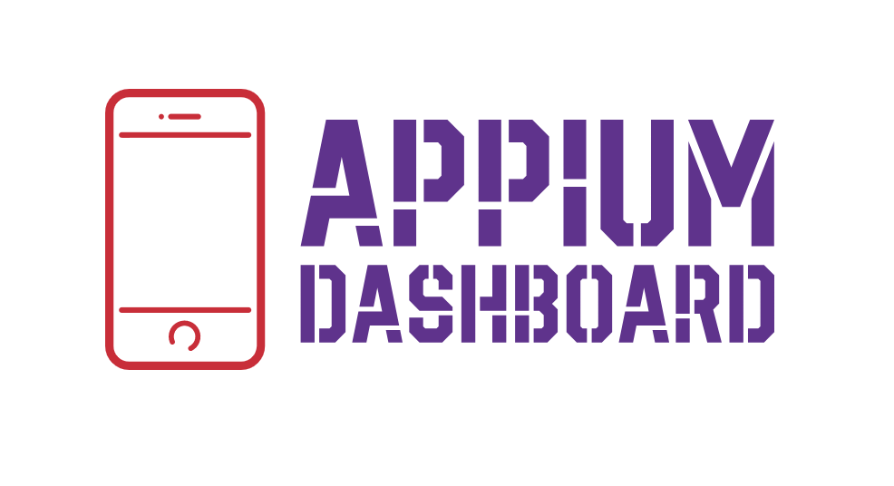

<p align="center">

</p>

<p align="center">
   <i><strong>Appium plugin that provides complete test logs, video recording of test and device logs(logcat and syslogs) for easy debugging of tests.</strong></i>
<p>

## Features

### Complete Session Log: (IOS and Android)

Monitor all webdriver session api calls made by the test will full request and response details.

https://user-images.githubusercontent.com/20136913/153456977-6032ed52-2437-495c-afe6-6e02825354d0.mov

### Live video stream: (IOS and Android)

Watch the live video of the test execution

https://user-images.githubusercontent.com/20136913/153455978-26cb7820-bf03-47dc-a5c6-af26724efe2c.mp4

### Device Logs: (IOS and Android)

View device logs from android(logcat) and Ios(syslogs) devices/emulators.

### App Profiling: (Android)

Get insignts on the performance of the application by analysing the CPU and Memory usage during the test execution.


### Network Logs: (Android)

Monitor the network requests made by native/hybrid appilcation(inside WebView) and web based tests that runs on chrome browser

https://user-images.githubusercontent.com/20136913/153460750-7dd49ef6-4451-464a-8084-f18a3d128b40.mov

### Execute webdriver.io scripts: (Android & IOS)

Ability to run webdriver.io script on a running session for better debugging.

https://user-images.githubusercontent.com/20136913/155574091-aedd55cc-63ef-4a9a-b659-e8f273a71674.mp4

### And lot more yet to come....

## Installation

This plugin requires Appium version 2.0. Once appium 2.0 is installed, run the bellow command to install the plugin

```sh
appium plugin install --source=npm appium-dashboard
```

## Plugin Activation

Once the installion is done, the plugin needs to be activated each time when the appium server is started using below command

```sh
appium --use-plugin=appium-dashboard
```

Now navigate to `http://localhost:4723/dashboard` to open the web app which will show the complete list of tests and its details that are being executed.

NOTE: This plugin is still in beta phase and heavy testing is being done to eliminate all possible issues along with lot other new features.

## Custom capabilitis:

| Name                           | Type    | Description                                                                                           | Example                                   |
| ------------------------------ | ------- | ----------------------------------------------------------------------------------------------------- | ----------------------------------------- |
| dashboard:name                 | string  | Custom name for the session                                                                           | `{"dashboard:name" : Sample login test }` |
| dashboard:enableLiveVideo      | boolean | if `true` live video of the execution will be streamed from the dashboard                             | defaults to `true`                        |
| dashboard:enableVideoRecording | boolean | if `true`, video recording of the session can be viewd from the dashboard after the session is killed | defaults to `true`                        |
