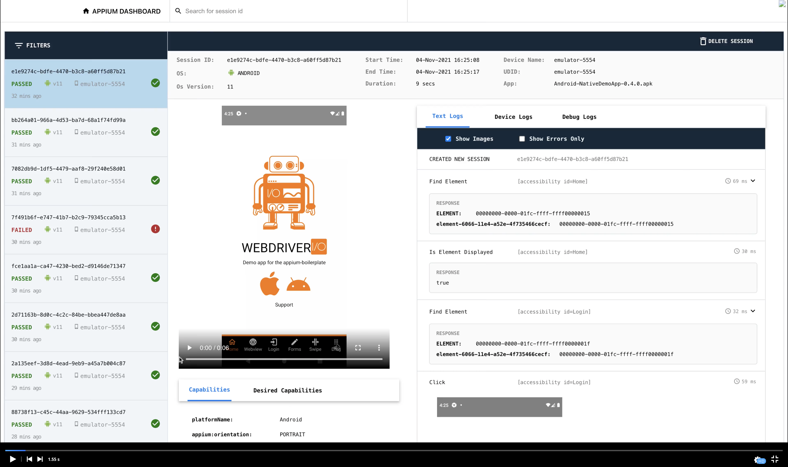

<p align="center">

</p>

<p align="center">
   <i><strong>Appium plugin that provides complete test logs, video recording of test and device logs(logcat and syslogs) for easy debugging of tests.</strong></i>
<p>

## Sample Preview

Check the sample video [here](https://gfycat.com/sharpincompletehorsechestnutleafminer)

### Screenshot

<p align="center">
<a href="https://gfycat.com/sharpincompletehorsechestnutleafminer">

</a></p>

## Installation

This plugin requires Appium version 2.0. Once appium 2.0 is installed, run the bellow command to install the plugin

```sh
appium plugin install --source=npm appium-device-farm
```

## Plugin Activation

Once the installion is done, the plugin needs to be activated each time when the appium server is started using below command

```sh
appium --plugins=appium-dashboard
```

Now navigate to `http://localhost:4723/dashboard` to open the client web app which will show the complete list of tests and its details that are being executed.

NOTE: This plugin is still in beta phase and heavy testing is being done to eliminate all possible issues along with lot other new features.
